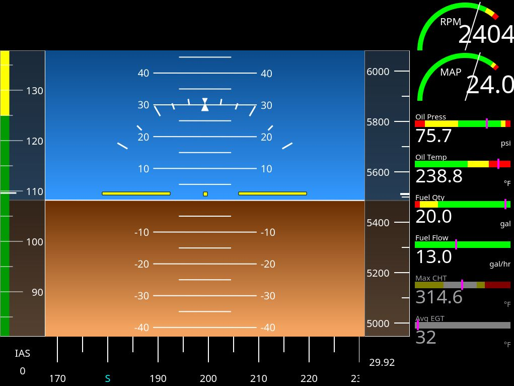

# OpenEFIS Flight Information Display, Sensor Processing and Autopilot



This is an X-Plane screen shot taken of the autopilot landing a 747:


# openEFIS
An EFIS system for aircraft. Uses small, inexpensive sensors through an Arduino board.
Includes an autopilot capable of flying multi-engine drone type VTOL craft, or fixed wing aircraft,
everything from a Cessna 172 to a 747.

To understand the code structure, see Readme.odg

There are several ways to install and run this software:

X-Plane Autopilot Test Mode
------------------------------------------------------------

Dependencies: X-Plane

To run:
Simply start X-Plane, and select your aircraft. Config files are
pre-made for Cessna 172, the Avanti, and the Boeing 747.
 (172.cfg, avanti.cfg, and 747.cfg)
Those config files assume X-plane and the autopilot are running on
the same host (localhost), but if not, you will have to change the
X-Plane host address to the proper address.

Then run the autopilot:
```
Fly.py <aircraft config> <flight plan>
```

If you are starting on a runway, a good sample flight plan is takeoff.pln
Make sure to release the brakes in X-plane right after starting Fly.py -- the autopilot
does not control brakes.

Display an EFIS with real sensors
---------------------------------------------------------------
Software Dependencies: pyyaml, pyserial
Hardware Dependencies: An Arduino Mega with something like an Adafruit 10DOF
                       sensor board on the I2C bus, and a GPS on an alternate
                       serial port. Modify sensors.yml as necessary.

To Run:
4 programs need to run:
1. PubSub.py
2. SenseControlRemote.py on the host connected to the Arduino
3. RunMicroServers.py on the host that will process raw sensor feeds
4. Display.py on the host with the display

They may all be the same host, 4 different computers, or any combination thereof.
Modify sensors_pubsub.yml to reflect the correct IP addresses of the hosts you have chosen.

Then invoke:
```
PubSub.py
SenseControlRemote.py <USBport>
RunMicroServers.py
```
If you have no pitot tube with a seperate pressure sensor, the sensor processing
subsystem needs current winds to estimate the airspeed.
In any case, the sensor processing subsystem needs at least a barometric pressure
reading to properly compute altitude. To do this:
```
SendATISInfo.py # See argument options with the -h command line option
```

Then finally run:
```
Display.py
```

Alternatively, you can add a black box event recorder by running sensor processing and
the event DB in Docker containers:

You will need Docker installed

Modify PubSub.py to point to the sensors_pubsub_docker.yml file.
Create a docker private bridge network:
docker network create --driver bridge autopilot

```
build_images.sh     # Builds the required images
start_images.sh     # Starts the images
```
